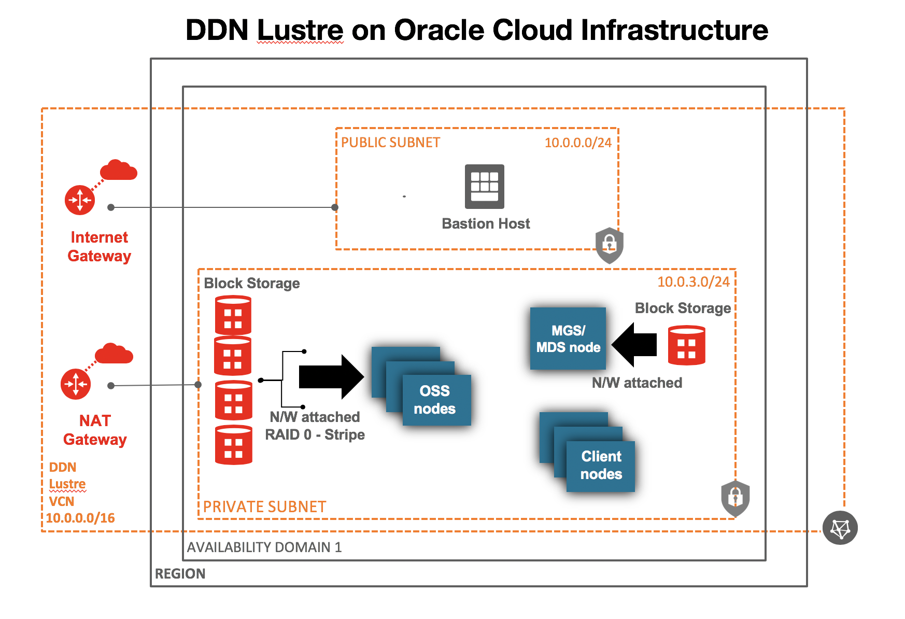

# oci-lustre
Terraform template to deploy Lustre file system on Oracle Cloud Infrastructure (OCI).

# High Level Architecture 

## Prerequisites
First off you'll need to do some pre deploy setup.  That's all detailed [here](https://github.com/cloud-partners/oci-prerequisites).

## Clone the Terraform template
Now, you'll want a local copy of this repo.  You can make that with the commands:

    git clone https://github.com/oci-quickstart/oci-lustre.git
    cd oci-lustre/terraform
    ls

## Update variables.tf file (optional)
This is optional, but you can update the variables.tf to change compute shapes, block volumes, etc. 

## Deployment & Post Deployment

Deploy using standard Terraform commands

        cd terraform
        terraform init && terraform plan && terraform apply

