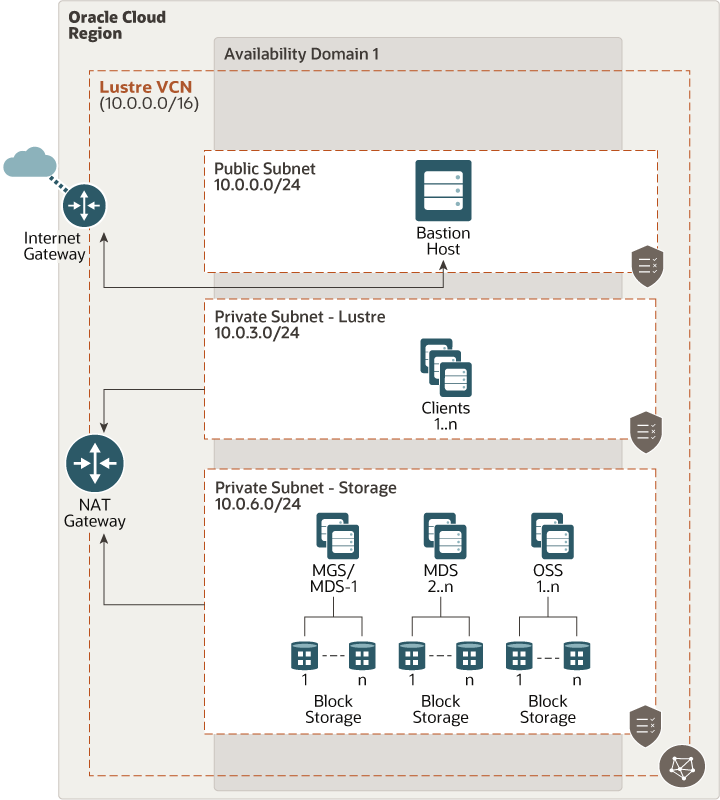

# oci-lustre

This Terraform template deploys [Lustre](http://lustre.org/) on [Oracle Cloud Infrastructure (OCI)](https://cloud.oracle.com/en_US/cloud-infrastructure) on Bare metal or VM compute shapes (Standard or DenseIO) using local NVMe SSDs (for scratch file system) or OCI Block Volume Storage (for persistent file system).  Bare metal compute shapes with two physical NICs (2x25Gbps or 2x50Gbps)  are recommended for file servers to get maximum IO throughput performance.   

The template deploys MGS, MGS and OSS on separate compute nodes. It supports multiple MDS and OSS nodes.  

OCI offers many compute shapes and storage offerings, reach out for OCI HPC team member (pinkesh.valdria@oracle.com) for guidance on which OCI compute shapes, storage to use and architecting Lustre on OCI for optimal performance.  

For details of the architecture, see [_Deploy a scalable, distributed file system using Lustre_](https://docs.oracle.com/en/solutions/deploy-lustre-fs/index.html)
 
## Deploy Using Oracle Resource Manager

1. Click [](https://cloud.oracle.com/resourcemanager/stacks/create?region=home&zipUrl=https://github.com/oracle-quickstart/oci-lustre/releases/latest/download/oci-lustre-stack-latest.zip)

    If you aren't already signed in, when prompted, enter the tenancy and user credentials.

2. Review and accept the terms and conditions.

3. Select the region where you want to deploy the stack.

4. Follow the on-screen prompts and instructions to create the stack.

5. After creating the stack, click **Terraform Actions**, and select **Plan**.

6. Wait for the job to be completed, and review the plan.

    To make any changes, return to the Stack Details page, click **Edit Stack**, and make the required changes. Then, run the **Plan** action again.

7. If no further changes are necessary, return to the Stack Details page, click **Terraform Actions**, and select **Apply**. 

## Deploy Using the Terraform CLI

### Clone the Module

## Clone the Terraform template
Now, you'll want a local copy of this repo.  You can make that with the commands:

    git clone https://github.com/oracle-quickstart/oci-lustre.git
    cd oci-lustre/
    ls

### Prerequisites
First off, you'll need to do some pre-deploy setup.  That's all detailed [here](https://github.com/cloud-partners/oci-prerequisites).

Secondly, create a `terraform.tfvars` file and populate with the following information:

```
# Authentication
tenancy_ocid         = "<tenancy_ocid>"
user_ocid            = "<user_ocid>"
fingerprint          = "<finger_print>"
private_key_path     = "<pem_private_key_path>"

# Region
region = "<oci_region>"

# Compartment
compartment_ocid = "<compartment_ocid>"

# Availablity Domain 
ad_name = <ad_name>   # for example "GrCH:US-ASHBURN-AD-1"

````    

## Update variables.tf file (optional)
This is optional, but you can update the variables.tf to change compute shapes, block volumes, etc. 

### Create the Resources
Run the following commands:

    terraform init
    terraform plan
    terraform apply

### Destroy the Deployment
When you no longer need the deployment, you can run this command to destroy the resources:

    terraform destroy

## Architecture Diagram

