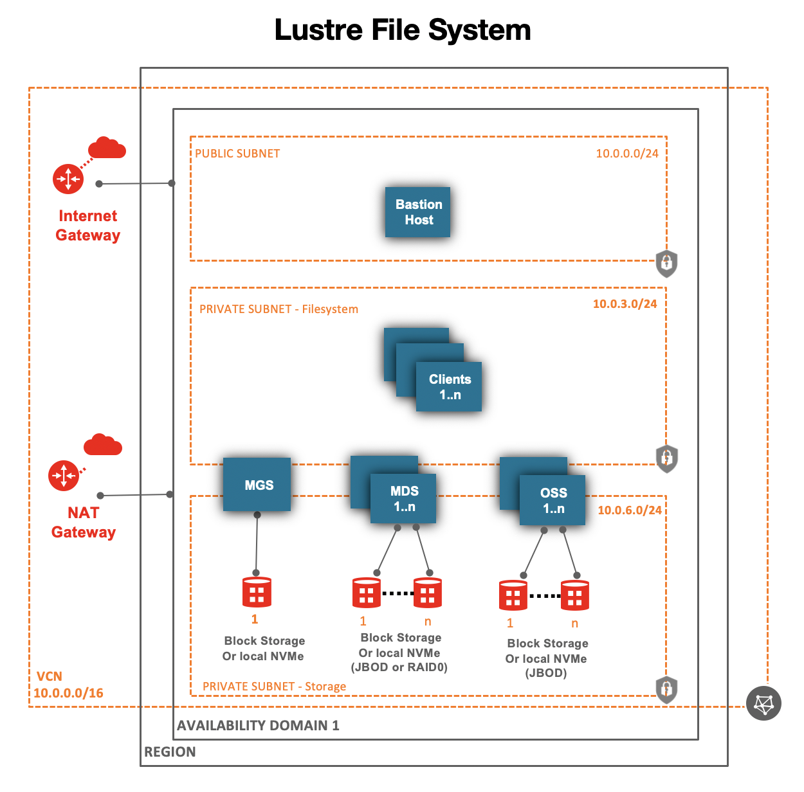

# oci-lustre
This Terraform template deploys [Lustre](http://lustre.org/) on [Oracle Cloud Infrastructure (OCI)](https://cloud.oracle.com/en_US/cloud-infrastructure) on Bare metal or VM compute shapes (Standard or DenseIO) using local NVMe SSDs (for scratch file system) or OCI Block Volume Storage (for persistent file system).  Bare metal compute shapes with two physical NICs (2x25Gbps or 2x50Gbps)  are recommended for file servers to get maximum IO throughput performance.   

The template deploys MGS, MGS and OSS on separate compute nodes. It supports multiple MDS and OSS nodes.  

OCI offers many compute shapes and storage offerings,  reach out for OCI HPC team member (pinkesh.valdria@oracle.com) for guidance on which OCI compute shapes, storage to use and architecting Lustre on OCI for optimal performance.  
 
## High Level Architecture 

## Prerequisites
First off you'll need to do some pre deploy setup.  That's all detailed [here](https://github.com/oracle/oci-quickstart-prerequisites).

## Clone the Terraform template
Now, you'll want a local copy of this repo.  You can make that with the commands:

    git clone https://github.com/oracle-quickstart/oci-lustre.git
    cd oci-lustre/terraform
    ls

## Update variables.tf file (optional)
This is optional, but you can update the variables.tf to change compute shapes, block volumes, etc. 

## Deployment and Post Deployment
Deploy using standard Terraform commands

        terraform init
        terraform plan
        terraform apply

